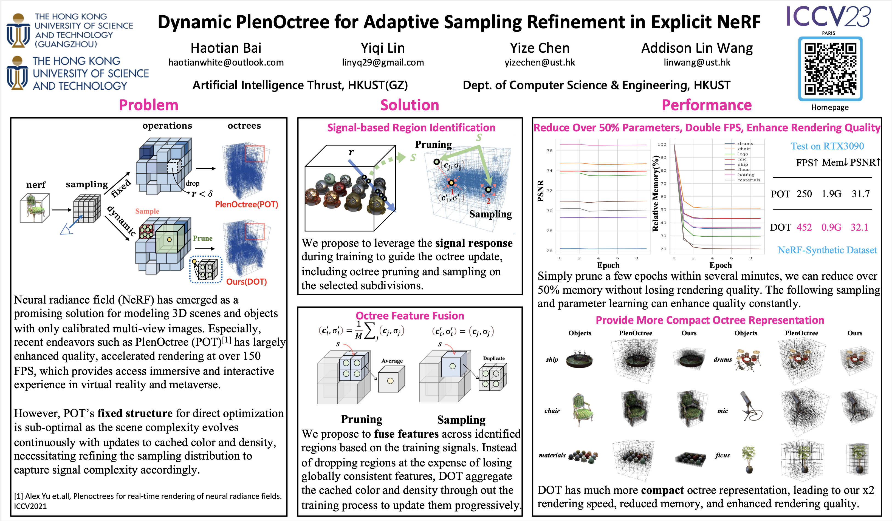
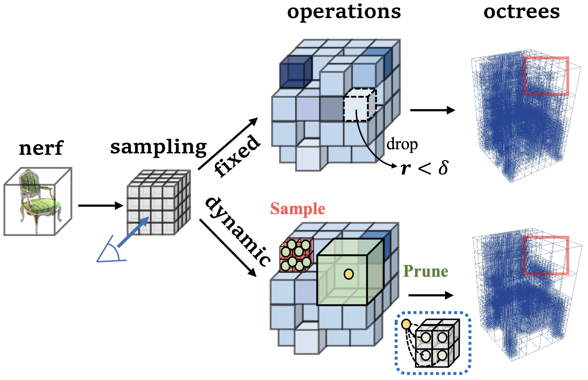

# DOT: Dynamic PlenOctree for Adaptive Sampling Refinement in Explicit NeRF

By [Haotian Bai](https://scholar.google.com/citations?hl=en&user=DIy4cA0AAAAJ), Yiqi Lin, Yize Chen, Lin Wang

### [Paper](http://arxiv.org/abs/2307.15333) | [Project Page](https://vlislab22.github.io/DOT) | [Youtube](https://www.youtube.com/watch?v=i9MnoFhH8Ec)

## Introduction
[ICCV 2023] The explicit neural radiance field (NeRF) has gained considerable interest for its efficient training and fast inference capabilities, making it a promising direction such as virtual reality and gaming. In particular, PlenOctree (POT) [1], an explicit hierarchical multi-scale octree representation, has emerged as a structural and influential framework. However, POT’s fixed structure for direct optimization is sub-optimal as the scene complexity evolves continuously with updates to cached color and density, necessitating refining the sampling distribution to capture signal complexity accordingly. To address this issue, we propose the dynamic PlenOctree (DOT), which adaptively refines the sample distribution to adjust to changing scene complexity. Specifically, DOT proposes a concise yet novel hierarchical feature fusion strategy during the iterative rendering process. Firstly, it identifies the regions of interest through training signals to ensure adaptive and efficient refinement. Next, rather than directly filtering out valueless nodes, DOT introduces the sampling and pruning operations for octrees to aggregate features, enabling rapid parameter learning. Compared with POT, our DOT outperforms it by enhancing visual quality, reducing over **55.15/68.84%** parameters, and providing **1.7/1.9** times FPS for NeRF-synthetic and Tanks & Temples, respectively. 

[1] Yu, Alex, et al. "Plenoctrees for real-time rendering of neural radiance fields." Proceedings of the IEEE/CVF International Conference on Computer Vision. 2021.

This is the official implementation of ["Dynamic PlenOctree for Adaptive Sampling Refinement in Explicit NeRF"](https://github.com/164140757/DOT) in PyTorch. Our code is built on [PlenOctree](https://github.com/sxyu/plenoctree). 

## Poster

## Overview

While the POT framework is effective, its fixed octree structure can limit its adaptability to varying scene complexities. We introduce hierarchical feature fusion with sampling/pruning to overcome this limitation, as illustrated by the dashed box below. Varying colors on the grid represent the training signals. 
Internal nodes are denoted in **orange**, while leaf nodes in **green**. Pruning nodes occurs in regions of weak signal, where cached properties in leaf ternal nodes are aggregated, and the averaged value is propagated to internal nodes, which become the new leaves. 
Complementary sampling takes place in the red regions. 
The resulting sampling distribution exhibits significant improvement, as highlighted by the red boxes in our final octree results.
## Updates
- [2023-09-24] Poster for ICCV 2023 is available!
- [2023-09-24] Youtube video is available!
- [2023-07-27] Initial Commits. Code publically available!

## Results and checkpoints
| Datasets | Model | GPU | Memory&#8595; | PSNR&#8593; | SSIM&#8593; | LPIPS&#8595; | FPS&#8593; | Checkpoints|
| :---: | :---:| :---: | :---: | :---: | :---: | :---: | :---: | :---: | 
| NeRF-Synthetic | POT | 3090 | 1.93G | 31.71 | 0.958 | 0.053 | 250.1|[Google Drive](https://drive.google.com/drive/folders/1-naLow6KZPsOYHa6N38sqNMRNKdRUwpb) 
| NeRF-Synthetic | DOT | 3090 | 0.87G | 32.11 | 0.959 | 0.053 | 452.1|[OneDrive](https://hkustgz-my.sharepoint.com/:f:/g/personal/haotianbai_hkust-gz_edu_cn/EnX_Ux5fNdVLiu1ksnrRb9wByIkdwHq54xzQ8Aavr3r7ag?e=qcDlZ5) 
| NeRF-Synthetic | DOT(R) | 3090 | 0.80G | 32.03 | 0.958 | 0.054 |474.2 |[OneDrive](https://hkustgz-my.sharepoint.com/:f:/g/personal/haotianbai_hkust-gz_edu_cn/EnX_Ux5fNdVLiu1ksnrRb9wByIkdwHq54xzQ8Aavr3r7ag?e=qcDlZ5)
| Tanks&Temples | POT | 3090 | 3.53G | 28.00 | 0.917 | 0.131 | 74.0|[Google Drive](https://drive.google.com/drive/folders/1VZvKZeRPfoljhGTi9w78__iWN-QQBw8U) 
| Tanks&Temples | DOT | 3090 | 1.10G | 28.28 | 0.922 | 0.121 | 186.2|[OneDrive](https://hkustgz-my.sharepoint.com/:f:/g/personal/haotianbai_hkust-gz_edu_cn/Eu3lrFk0Q6VPutSGYPEbSFEB20x6imJyeneLT-_cweUBmA?e=4RPVGf) 
| Tanks&Temples | DOT(R) | 3090 | 0.80G | 28.25 | 0.922 | 0.122 | 216.1|[OneDrive](https://hkustgz-my.sharepoint.com/:f:/g/personal/haotianbai_hkust-gz_edu_cn/Eu3lrFk0Q6VPutSGYPEbSFEB20x6imJyeneLT-_cweUBmA?e=4RPVGf) 
## Usage

### Installation


```
conda create -n dot python=3.8 -y
conda activate dot
python -m pip install --upgrade pip
```
Please refer to [Pytorch](https://pytorch.org/) for customized installation. 
```
pip install -r requirements.txt
cd dependencies/svox 
pip install .
```

For training addtional NeRF-SH models,
please refer to [PlenOctree](https://github.com/sxyu/plenoctree) and [Jax](https://github.com/google/jax#installation) for customized installation.  


### Dataset


You can download the pre-processed synthetic and real datasets used in our paper.
Please also cite the original papers if you use any of them in your work.

Dataset | Download Link | Notes on Dataset Split
---|---|---
[Synthetic-NSVF](https://github.com/facebookresearch/NSVF) | [download (.zip)](https://dl.fbaipublicfiles.com/nsvf/dataset/Synthetic_NSVF.zip) | 0_\* (training) 1_\* (validation) 2_\* (testing)
[Synthetic-NeRF](https://drive.google.com/file/d/18JxhpWD-4ZmuFKLzKlAw-w5PpzZxXOcG/view?usp=drive_link) | [download (.zip)](https://dl.fbaipublicfiles.com/nsvf/dataset/Synthetic_NeRF.zip) | 0_\* (training) 1_\* (validation) 2_\* (testing)
[BlendedMVS](https://github.com/YoYo000/BlendedMVS)  | [download (.zip)](https://dl.fbaipublicfiles.com/nsvf/dataset/BlendedMVS.zip) | 0_\* (training) 1_\* (testing)
[Tanks&Temples](https://www.tanksandtemples.org/) | [download (.zip)](https://dl.fbaipublicfiles.com/nsvf/dataset/TanksAndTemple.zip) | 0_\* (training) 1_\* (testing)

Note that as illustrated in our main paper, we target the **same** datasets including Synthetic-NeRF and Tanks&Temples as POT. Addtionally, we verify its scalability in BlendedMVS(See suppl. materials). Interested readers may testify other datasets such as Synthetic-NSVF with the link given above.


Next, we provide training, evaluation, and compression bash script in **train.sh** with hyperparameters for more options.

### Training

E.g., a standard DOT training is a only an optimization process(see octree/nerf/optimization.py) based on extracted raw octree from NeRF-SH (see octree/nerf/extraction.py) illustrated in 
[PlenOctree](https://github.com/sxyu/plenoctree). Our algorithm is embeded in revised optimization.py script(original script is POT_opt.py).
```
export THS_TYPE=weight
export THS_VAL=1e0
export DATA_ROOT=../../dataset/nerf_synthetic
export IN_CKPT_ROOT=~/checkpoints/DOT/pln/syn_sh16
export OUT_CKPT_ROOT=checkpoints/DOT/syn_sh16
export SCENE=chair 
export CONFIG_FILE=DOT/nerf_sh/config/blender
export epochs=100
export sample_every=20
export prune_every=1
export GPUs=0

CUDA_VISIBLE_DEVICES=$GPUs,
python -m DOT.octree.optimization \
    --input $IN_CKPT_ROOT/$SCENE/octrees/tree.npz \
    --config $CONFIG_FILE \
    --data_dir $DATA_ROOT/$SCENE/ \
    --output $OUT_CKPT_ROOT/$SCENE/dot_r.npz \
    --thresh_type $THS_TYPE \
    --thresh_val $THS_VAL \
    --num_epochs $epochs \
    --prune_every $prune_every \
    --sample_every $sample_every \
```

The detailed explaination of the hyperparameters:

Name | Description | Usage
---|---|---
input|input octree npz for a specific scene from extraction.py|--input {npz file path}
config|config file for a specific  dataset|--config {config file path}
data_dir|directory for a specific scene|--data_dir {scene directory path}
output|directory for storing the checkpoint file|--output {checkpoint file path}
thresh_type|training signal type(sigma /weight Q)|--thresh_type {weight or sigma}
thresh_val|training signal strength(1e0 for Syn/1e1 for T&T)|--thresh_val {value}
num_epochs|optimization.py training epochs|--num_epochs {value}
prune_every|iterative pruning frequncy (per epoch)|--prune_every {value}
sample_every|iterative sampling frequncy (per epoch)|--sample_every {value}

Addtionaly, there are other options to carry out ablation studies for single operations or the recursive pruning:

Name | Description | Usage
---|---|---
prune_only|DOT's single pruning operation|--prune_only
sample_only|DOT's single sampling operation|--sample_only
recursive_prune|DOT's recursive prunning option |--recursive_prune

For more details on training for Tanks & Templates, please refer to our train.sh which we have comments beside for this dataset:
e.g.,
```
export DATA_ROOT=../../dataset/TanksAndTemple # ../../dataset/nerf_synthetic | ../../dataset/TanksAndTemple
export CONFIG_FILE=DOT/nerf_sh/config/tt # DOT/nerf_sh/config/blender | DOT/nerf_sh/config/tt
```
### Evaluation

After training, dot.npz or dot_r.npz is availbale at the checkpoint output 

```
python -m DOT.octree.evaluation \
    --input $OUT_CKPT_ROOT/$SCENE/dot.npz \
    --config $CONFIG_FILE \
    --data_dir $DATA_ROOT/$SCENE/ \
    --write_images $OUT_CKPT_ROOT/$SCENE/octrees/dot_rend
```

### Compression

Compression by median-cut could be leveraged to support more lightweight web rendering at the cost of quality,
```
python -m DOT.octree.compression \
    $OUT_CKPT_ROOT/$SCENE/dot.npz \
    --out_dir $OUT_CKPT_ROOT/$SCENE/cp \
    --overwrite
```
## Visualization

Interested readers may refer to the octree visualization app [volrend](https://github.com/sxyu/volrend) to explore more about the octree sample distribution. 

## Citation
```
@inproceedings{Bai2023DOT,
  title={Dynamic PlenOctree for Adaptive Sampling Refinement in Explicit NeRF},
  author={Haotian Bai, Yiqi Lin, Yize Chen, Lin Wang},
  booktitle = {IEEE International Conference on Computer Vision (ICCV)},
  year={2023}
}
```
